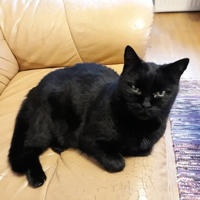
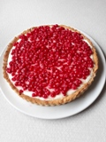

## Introduction

 Hello there all computerized linguists! I am an open university student studying general linguistics in the Helsinki University at the moment and finishing this course of Command-line Tools for Linguists. I have worked witihin chemical engineering and material analysis earlier, for example in pilot-scale production and development of new products and materials. There is a picture of my cat here on the front page. She is a 20-year-old creature that wakes me up every morning at about 5.30 am. 

## Find me on

[GitHub](https://khjaaske.github.com)

## Contact

My email address is of the form first_name.last_name@helsinki.fi. 

## My Curriculum Vitae

My curriculum vitae is [here](khjaaske.github.io/assets/documents/CV_khjaaske.pdf)

## Courses I've Taken

[Kieli ja identiteetti](https://studies.helsinki.fi/kurssit/opintojakso/otm-256b594d-cdd8-4b1b-b266-cc427872b130?cpId=hy-lv-74) , autumn 2024

[Introduction to Language Technology](https://studies.helsinki.fi/courses/course-unit/otm-96b452f8-1f60-4696-8f0e-50559973b315/KIK-405?cpId=hy-lv-75) , autumn 2024

## Projects
### Making Your Own Telescope Mirror

[Here](https://www.youtube.com/watch?app=desktop&v=WHmijeRitD8) is one link to a YouTube-video showing a simple silvering of a glass telescope mirror.

One of my projects during my earlier years was to make a Newtonian telescope mirror of my own. So I, with a friend of mine, purchased two-centimeter-thick 20-cm diameter blocks of glass to be ground to mirrors. 
So we read a guide book by Jari Turunen (Kaukoputken rakentajan käsikirja (ISBN 9519269290), 1985, 127 pages, in Finnish) and bought the materials needed to make our own Newtonian mirrors. 
We worked in the basement (in the bomb shelter) of our institute after work and ground the glass blocks using aluminum oxide grinding powders (continuously finer grades) and measured the depth of the mirrors to define the focal length and then we measured the correct shape of the mirror using a Ronchi grating in a dark room (available in our institute). 

After the coarse grinding we did the polishing of the mirror on a pitch tool that was the original counterpart of the first grinding, only coated with a pitch cover for a smooth surface polish and a cerium oxide polishing powder, always with deionised water for a lubricant.
 
After the polishing we could have used quick dissolution of sugar into glucose and fructose using strong acids (that we had at our disposal in the laboratory) but we used the older method of Turunen (1985) and dissolved sucrose with lactic acid into glucose and fructose. Then we mixed a solution of silver nitrate (to get silver coating), sodium hydroxide and ammonium nitrate (to get a reducible silver solution), put the uncoated and cleaned glass mirrors into a bath of this sugar solution and poured the silver-ammonium-hydroxide solution onto the mirror into the sugar solution. One of the sugars oxidises directly and the other sugar oxidises through a keto-enol-tautomerism into... well... oxidised sugars and at the same time the silver in the solution reduces into metallic silver onto any surfaces that are in the bath, that is, on to the glass thereby producing a silver mirror surface.

The outcome was a white pale surface without any shiny mirror and we needed to wash it with ethanol and then to seal the surface by rubbing and pressing it with a chamois-leather to get the shiny silver mirror surface. That is the process of pushing the metallic layers of silver into tighter cover onto the surface of the glass.
We had used the most of the silver nitrate (which is quite expensive if you use the laboratory grade) of the laboratories of the institute but our supervisor said there's no problem. 

What was the outcome of this project? Well, for the first time I managed to see the Martian icecaps on the north pole of Mars and I could see the atmospheric belts of Jupiter and later even Mercury and Venus overpass over the Sun with some photographs. 
The telescope served its time and went out of service but the mirror is still with me, hanging on the wall. The other side is of it is an  oxidised surface, pale with spectrum colors on the silver surface, and when I turn it around it is still a mirror, hanging on a wall. If you would put that mirror into a telescope again, the view would still be the same. The oxidised outer layer is only on the very surface but the reflecting surface of the innermost layer would still be the same as it was when it was created.

## Misc. 

[Gotta Love Mushrooms](https://en.wikipedia.org/wiki/Edible_mushroom)
[And Berries Too](https://en.wikipedia.org/wiki/List_of_fruit_dishes)

